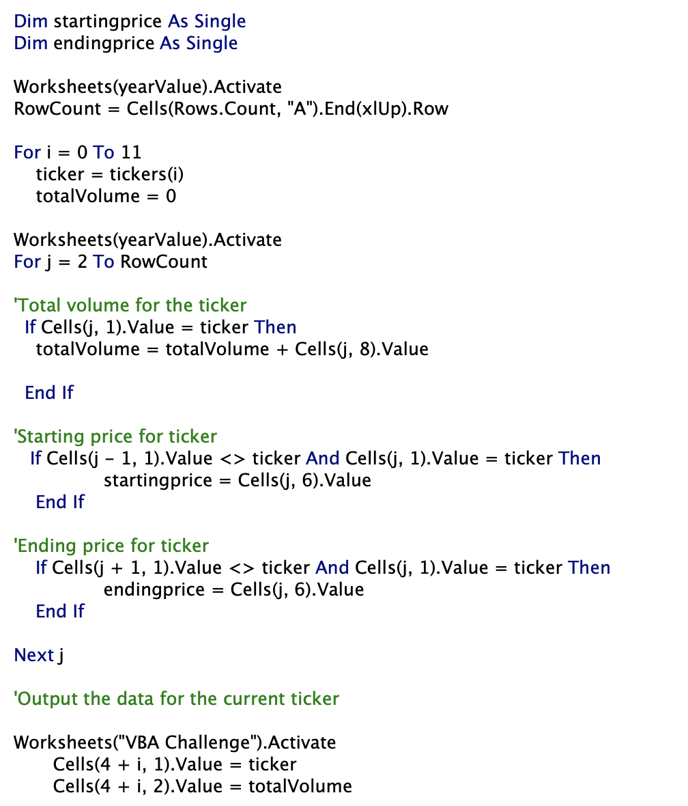
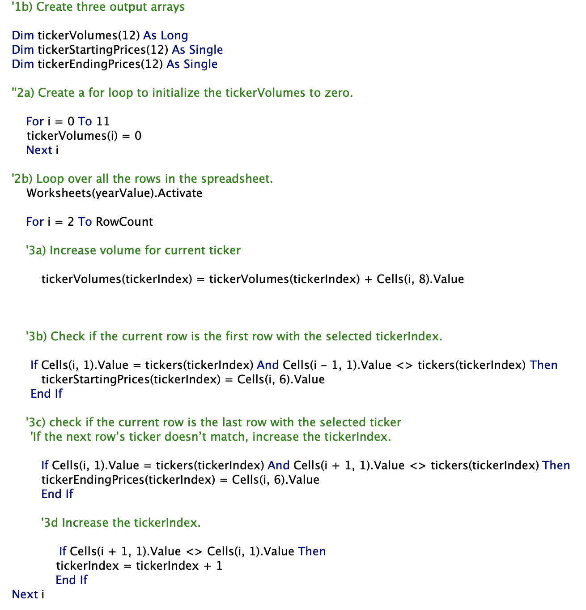

# VBA Stock Analysis Challenge 

## Overview

The purpose of this project was refactoring of the code to analyze stock data from any year within the workbook. Originally, nested loop statements were used to analyze a small dataset. However, it was obvious that the efficiency would decrease with larger data sets. To avoid that, the objective was to refactor the code to increase the efficiency by looping through the dataset once. 

## Results 

### Original Code 

The original code used nested loops to find stock changes for a specified year in the data. An array of the ticker values desired was created, which was used as an index for the outer loop, while the inner loop went through the data looking for information that matched the indexed ticker.

   

  

This returned the information in 0.5625 and 0.578125 seconds for 2017 and 2018 respectively.

   

 

   

  
 

### Refactored Code

In order to make the code more efficient, nested loops were dropped in favor of several arrays and a series of loops. 

   

 

The refactored code allowed the program to run through the information 1 time, and return the same information in quicker than the original code.

   

 

   

 

## Summary  

Refactoring code was a great way to explore finding alternative methods to a previously successful one. It also allowed further opportunities to debug different types of coding issues. Refactoring does have disadvantages as well. If the code was not properly annotated then it could be hard to decipher the purpose of a certain line or section of code. There is also the issue of the code not working once reworked. In this project, I found that the new code did not work right away for the 2017 page as there was some problems with the data itself. While it worked in the end, it did take some time to find the cause of the issue. The data corruption was not an issue with the original code, and for our small data set, the original code did the job just fine. Having worked with both, I do like the speed and efficiency of the refactored code, but knowing its more temperamental with respect to data corruption, It may require some more refactoring to work through corruptions. 
